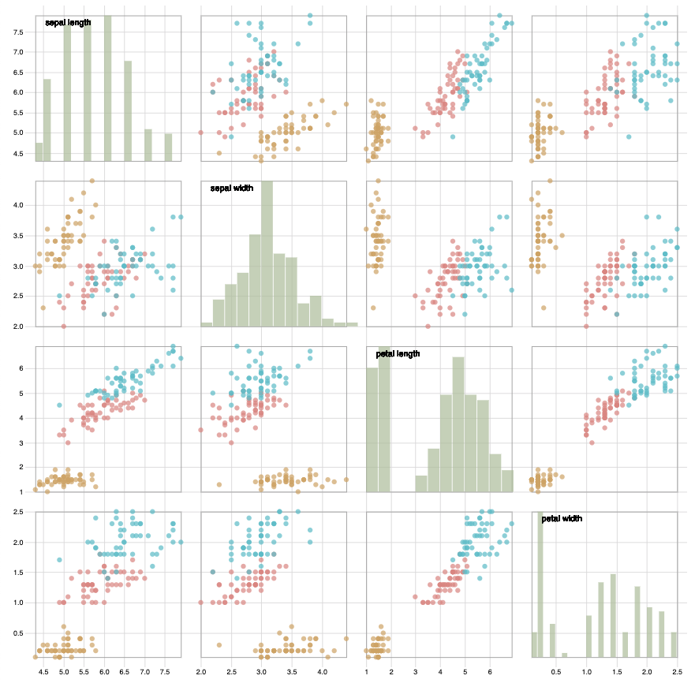
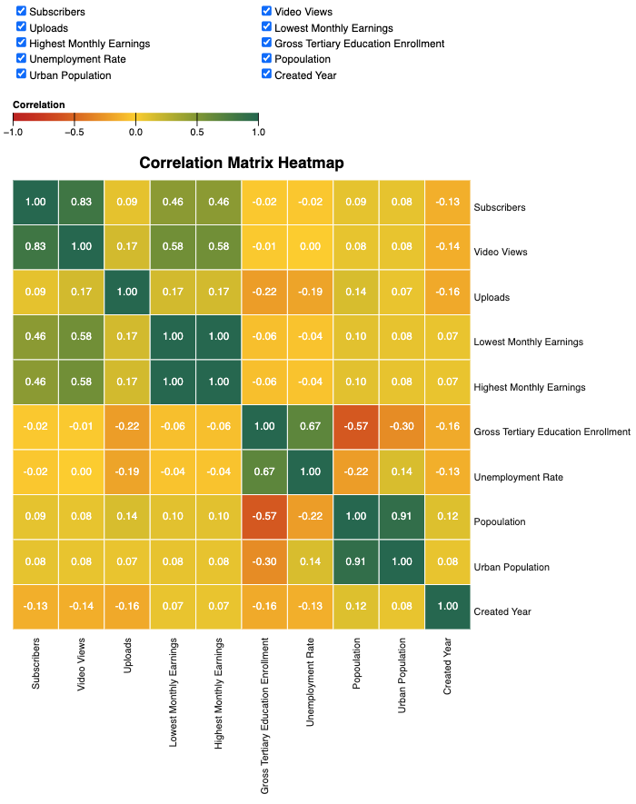
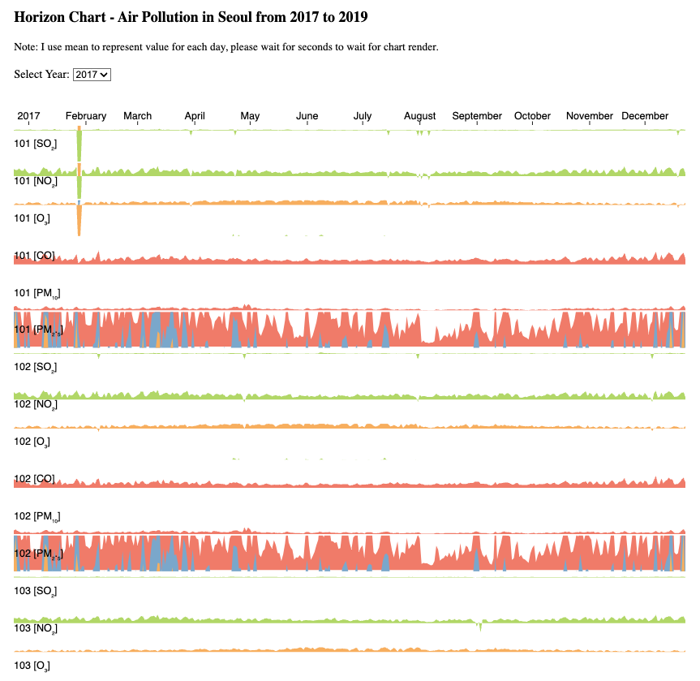
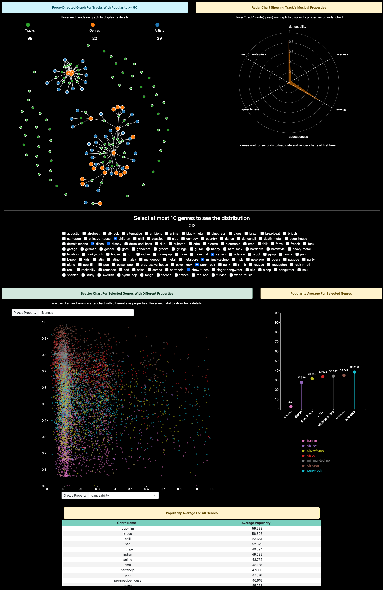
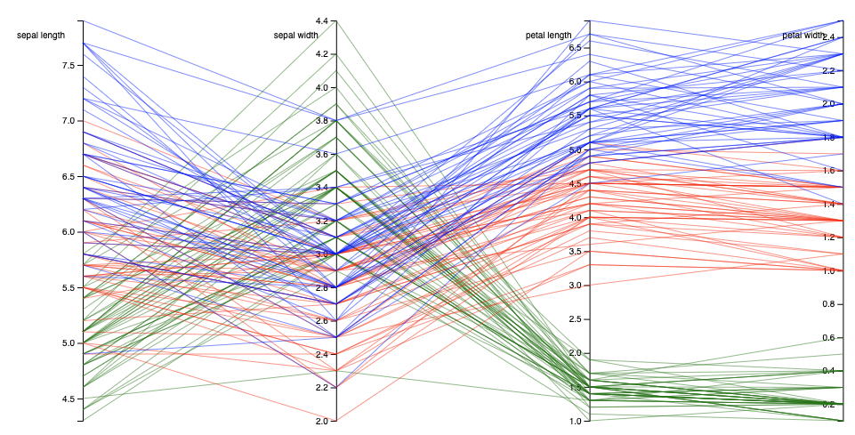
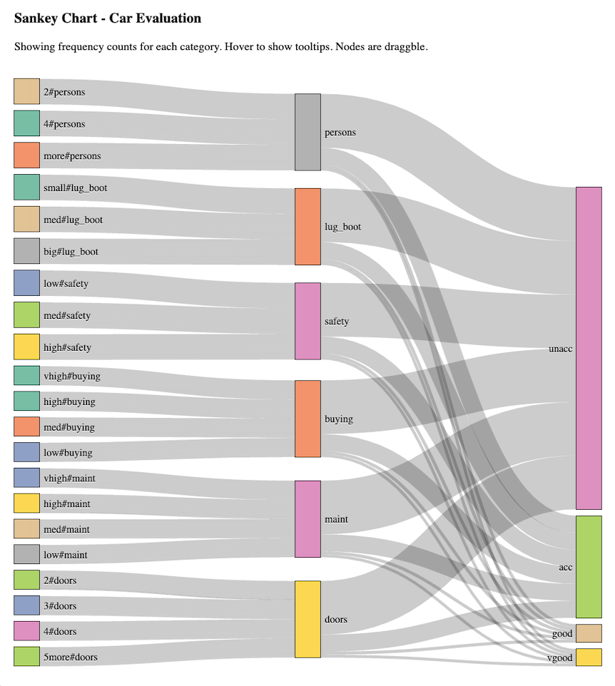
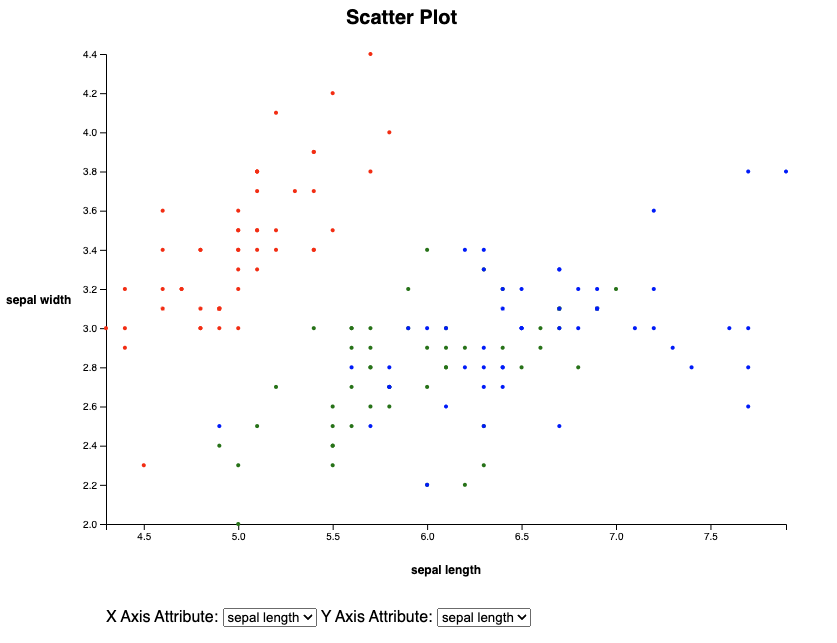
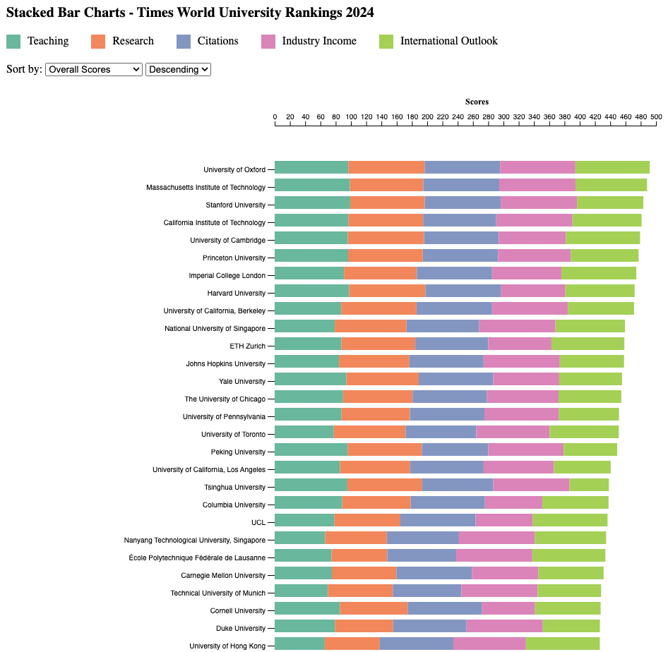
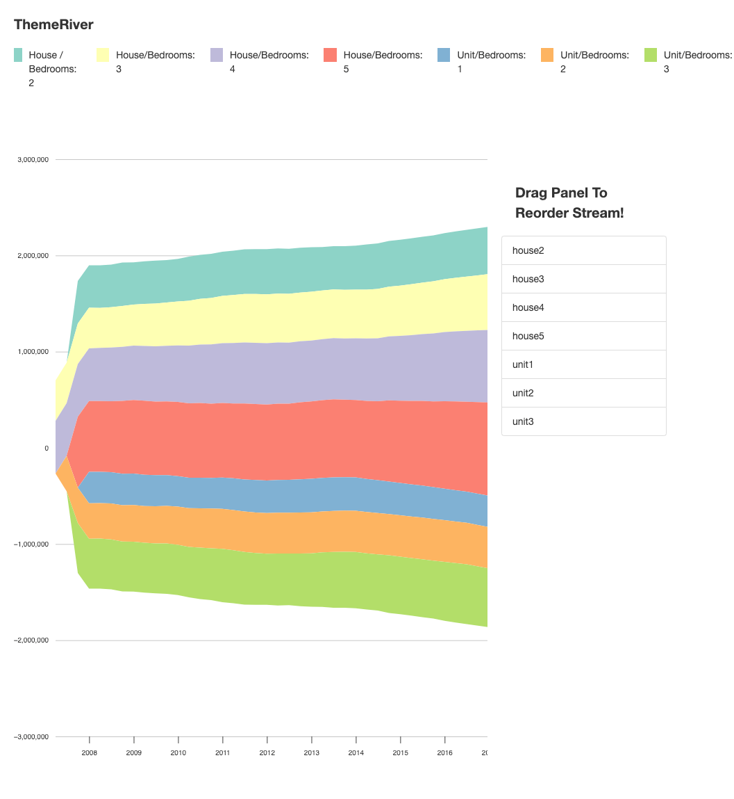

# D3.js Graph Demo
	> Usage: Clone and open HTML file

### Brushable Scatter Plot Matrix
- Data Source: https://archive.ics.uci.edu/dataset/53/iris
- Each plot represent the relationship between two attributes
- User can select specific data points within a plot, and these selected points are emphasized

### Correlation Matrix Heatmap
- Data Source: https://www.kaggle.com/datasets/nelgiriyewithana/global-youtube-statistics-2023
- The heatmap showing the correlation between continuous variables
- User can select input variables to change heatmap

### Horizon Chart
- Data Source: https://www.kaggle.com/datasets/bappekim/air-pollution-in-seoul
- There are 25 districts in Seoul and data is available for 6 different pollutants so 150 horizon charts are created
- Aggregated hourly data into daily average for proper display
- User can select sepcific year of data to display charts

### Force-Directed Graph & Radar Chart & Scatter Chart & Lollipop Chart
- Data Source: https://www.kaggle.com/datasets/maharshipandya/-spotify-tracks-dataset?resource=download
- Force-directed graph shows the connections between different nodes
- Hovering on “track” type node will show its 6 different audio features. These features measures from 0.0 to 1.0 so they can be compared together.
- User can select up to 10 genres to compare their audio features distribution and zoom in/out to inspect more details. At the same time, the lollipop chart will show the popularity average for the selected genres.

### Parallel Coordinate Plot
- Data Source: https://archive.ics.uci.edu/dataset/53/iris

### Sankey Chart
- Data Source: https://archive.ics.uci.edu/dataset/19/car+evaluation
- Display relationships between the categorical attributes: buying, maintenance, doors, persons, luggage boot, and safety
-The width of the bands in the Sankey Diagram represents the count of the dataset that holds that relationship
- User can drag nodes for more clear displaying

### Scatter Plot
- Data Source: https://archive.ics.uci.edu/dataset/53/iris
- User can select different attributes to show scatter relationship

### Stacked Bar Chart
- Data Source: https://www.kaggle.com/datasets/ddosad/timesworlduniversityrankings2024
- Every stacked bar represent the total score of a particular university
Within each bar, the scores for different criteria—namely teaching, research, citations, industry income, and international—should be clearly distinguishable
- User can sort by overall scores or by each individual criterion (teaching, research, citations, industry income, and international) both in ascending and descending orders

### ThemeRiver
- Data Source: https://www.kaggle.com/datasets/htagholdings/property-sales
- Show streams for two property types and various bedrooms, with each stream showing the median price aggregation over time
- User can reorder the streams

